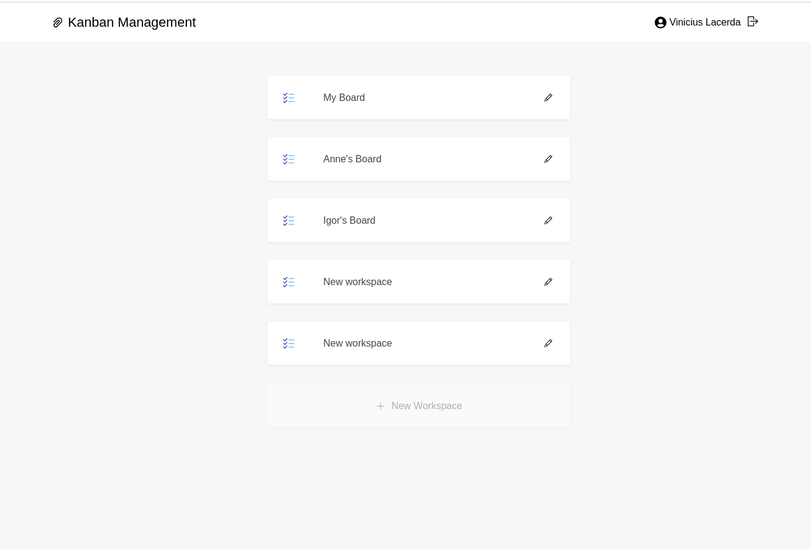
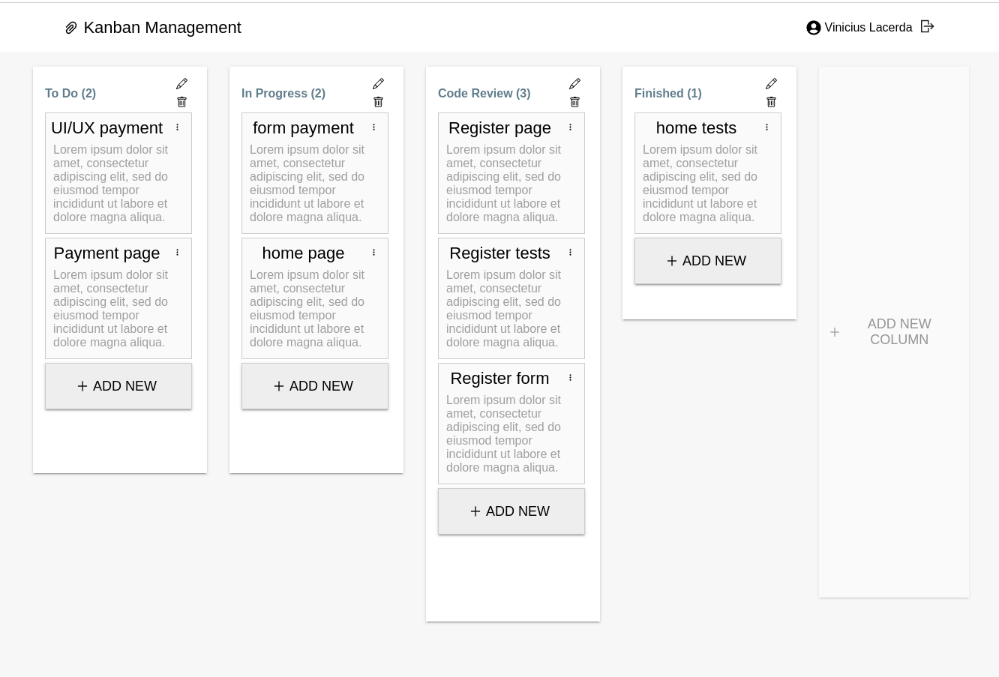

# Kanban Task Management

## Context

This project is Kanban manager. It is possible to create new workspaces, add registered users and define which ones will be administrators.

Within the workspace it is possible to create new columns, edit and delete them.

New cards are editable and it is possible to change their position.

## Technologies Used

  ### Back-end
    - Node.js
    - Express
    - TypeScript
    - MySQL
    - Sequelize
    - Cors
  
  ### Front-end
    - React.js
    - TypeScript
    - CSS3
    - Axios
    - Redux
  
  ### Testing
    - JEST
    - Chai
    - Mocha
    - Sinon

  ### Tools
    - Docker
    - Git

## Local Usage
### Installing dependencies
```bash
cd kanban-task-management && cd backend && npm install
``` 
### Running Docker Containers:
> Run the command below in the ```/backend``` directory 
```bash
docker-compose up -d --build && npm run db:reset
``` 
This command will start containers called ```db```, ```backend``` and ```frontend```, create and populate the database. There are four previously registered accounts. The backend server is now available and it is possible to interact with the API. To make requests locally - with ThunderClient, for example - use the endpoint http://localhost:3001/

Access the page in your preferred browser through <a href="http://localhost:3000/">localhost:3000<a/>
## Login

### Registered accounts:

<table border="1">
    <tr>
      <td><b>E-mail</></td>
      <td><b>Password</b></td>
    </tr>
    <tr>
      <td>vinicius@email.com</td>
      <td>MyPassword</td>
    </tr>
    <tr>
      <td>zita@email.com</td>
      <td>MyPassword</td>
    </tr>
    <tr>
      <td>marianne@email.com</td>
      <td>MyPassword</td>
    </tr>
    <tr>
      <td>igor@email.com</td>
      <td>MyPassword</td>
    </tr>
</table>

### Running Tests
  * To run all unit tests run in ```/backend``` directory :  

```bash
    npm run test:unit
``` 

* To run all integration tests run in ```/backend``` directory : 

```bash
     npm run test:integration
``` 
  
### Screenshots
<div>
  
  
  
</div>
